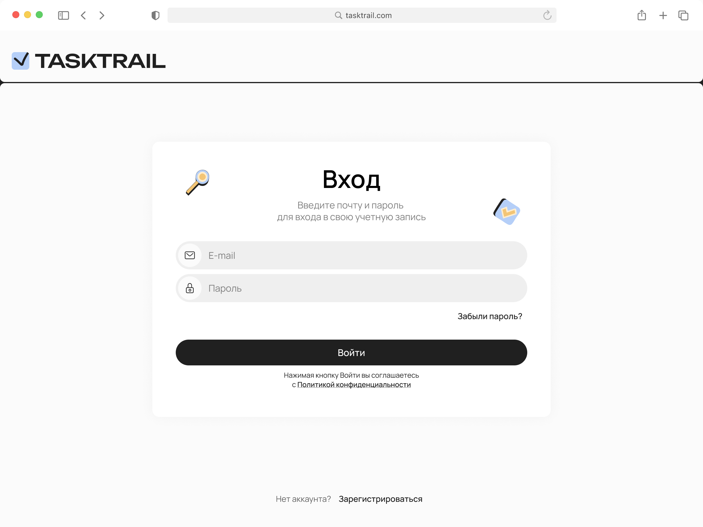
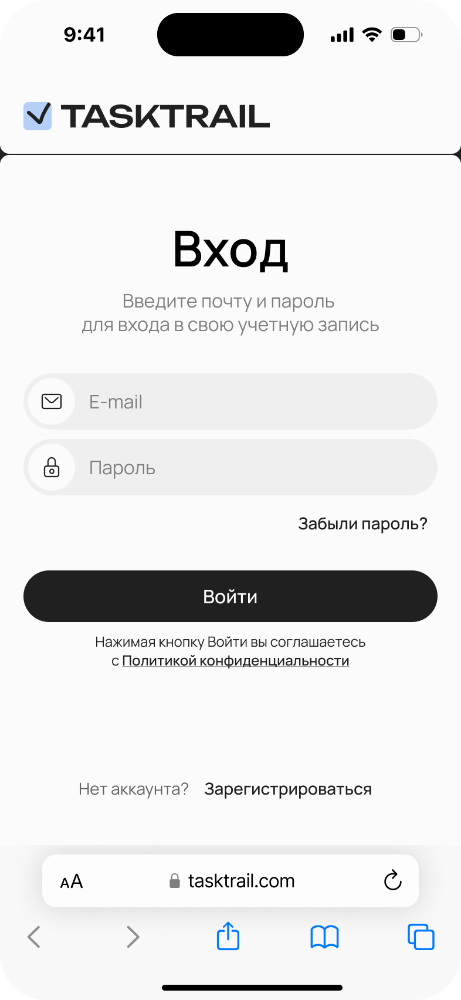

# TaskTrail


---

🚀 **Live Demo:** [https://dev.hiraise.net/tasktrail/](https://dev.hiraise.net/tasktrail/)

---

TaskTrail is a modern, open-source, self-hosted task tracking web application built with **Next.js** and TypeScript. The project follows a modular, Clean Architecture-inspired structure for scalability, maintainability, and clear separation of concerns.

## Features

- **Authentication**: Complete auth flow (login, signup, password recovery, email confirmation)
- **Project Management**: Create, edit, and manage projects with member permissions
- **Task Management**: Full task lifecycle with assignments, comments, and status tracking
- **Kanban Boards**: Drag-and-drop task boards with customizable columns
- **Global Search**: Search across projects, tasks, and boards
- **User Profiles**: Profile management with avatar upload and image cropping
- **State Management**: Client-side state with Zustand, server-side state with React Query
- **Responsive Design**: Mobile-first, adaptive UI for all screen sizes with dedicated mobile/desktop layouts
- **Localization**: Multi-language support (ru/en) for text and images
- **Reusable Components**: Rich library of UI components, modals, and feature-specific widgets
- **Form Management**: Type-safe forms with React Hook Form and Zod validation
- **Drag & Drop**: Advanced drag-and-drop functionality with @dnd-kit
- **Animations**: Smooth animations and transitions with Motion
- **Centralized Error Handling**: Global and local error management
- **Clean Architecture**: Clear separation of concerns with domain, application, infrastructure, and presentation layers
- **Testing**: Unit and integration tests with Jest and React Testing Library
- **Docker Support**: Containerized deployment with Dockerfile

## ✨ Features

### Login Page

Here's a sneak peek of our clean and intuitive login interface, available on both desktop and mobile devices.

|                      Desktop                      |                     Mobile                      |
| :-----------------------------------------------: | :---------------------------------------------: |
|  |  |

## Tech Stack

- **Next.js 16** (App Router, SSR, Turbopack)
- **TypeScript 5**
- **React 19**
- **Zustand** (for client-side state management)
- **React Query** (@tanstack/react-query for server-side state management)
- **CSS Modules** (primary styling approach)
- **Motion** (for animations)
- **React Hook Form** + **Zod** (for form management and validation)
- **@dnd-kit** (for drag-and-drop functionality)
- **Sonner** (for toast notifications)
- **Axios** (for HTTP requests)
- **Jest** + **React Testing Library** (for testing)
- **ESLint** + **Prettier** (for code quality)

## Project Structure

```
src/
├── app/                     # Next.js App Router, pages, and layouts
│   ├── (main)/              # Main application routes
│   │   ├── boards/          # Kanban boards
│   │   ├── projects/        # Project management
│   │   ├── tasks/           # Task management
│   │   ├── profile/         # User profile
│   │   └── search/          # Global search
│   ├── auth/                # Authentication pages (login, signup, etc.)
│   ├── layout.tsx           # Root layout
│   └── globals.css          # Global styles
├── application/             # Application-level logic (use cases)
│   ├── dto/                 # Data Transfer Objects
│   ├── payloads/            # Request/Response payloads
│   └── usecases/            # Business use cases
│       ├── auth/
│       ├── project/
│       ├── projectMember/
│       ├── task/
│       └── user/
├── domain/                  # Core business logic and entities
│   ├── models/              # Domain models
│   ├── repositories/        # Repository interfaces
│   └── types/               # Domain types
├── infrastructure/          # External integrations
│   ├── config/              # Configuration
│   ├── di/                  # Dependency injection
│   ├── http/                # HTTP clients (Axios)
│   └── repositories/        # Repository implementations
├── presentation/            # UI layer
│   ├── app/                 # App-level components
│   ├── features/            # Feature-specific components
│   │   ├── auth/
│   │   ├── boards/
│   │   ├── projects/
│   │   ├── tasks/
│   │   └── user/
│   └── shared/              # Shared presentation components
│       ├── components/      # Reusable components
│       ├── ui/              # Base UI components
│       ├── modals/          # Modal dialogs
│       └── hooks/           # Custom React hooks
└── shared/                  # Shared utilities across layers
    ├── config/
    ├── constants/
    ├── errors/
    ├── locales/
    └── utils/
```

## Getting Started

### Prerequisites

- **Node.js** (v18 or higher)
- **npm** (v9 or higher) or **yarn**

### Installation

1.  **Clone the repository:**

    ```bash
    git clone https://github.com/SergeyRusinovich/tt-frontend.git
    ```

2.  **Navigate to the project directory:**

    ```bash
    cd tt-frontend
    ```

3.  **Install dependencies:**
    ```bash
    npm install
    # or
    yarn install
    ```

### Running the Development Server

To run the app in development mode, use:

```bash
npm run dev
# or
yarn dev
```

The application will be available at [http://localhost:3000](http://localhost:3000).

### Building for Production

To build the application for production, use:

```bash
npm run build
```

This will create an optimized build in the `.next` directory.

### Running Tests

To run the test suite, use:

```bash
npm test
```

## Contributing

Contributions are welcome! If you'd like to contribute, please follow these steps:

1.  **Fork the repository.**
2.  **Create a new branch:**
    ```bash
    git checkout -b feature/your-feature-name
    ```
3.  **Make your changes and commit them:**
    ```bash
    git commit -m "feat: Add your new feature"
    ```
4.  **Push to your branch:**
    ```bash
    git push origin feature/your-feature-name
    ```
5.  **Open a pull request** against the `main` branch.

## Roadmap

- [x] Authentication system (login, signup, password recovery, confirmation)
- [x] Route protection with auth guard
- [x] Kanban board with drag-and-drop
- [x] User profile page with avatar management
- [x] Full project management (CRUD operations, member management)
- [x] Complete task management (create, edit, assign, comment, status tracking)
- [x] Global search functionality
- [x] Responsive mobile and desktop layouts
- [x] Docker containerization
- [ ] Real backend integration (currently using mock API)
- [ ] Real-time collaboration features
- [ ] Notifications system
- [ ] Task attachments and file management
- [ ] Advanced project analytics and reporting

## License

This project is licensed under the MIT License. See the [LICENSE](LICENSE) file for details.

## Architecture Overview

TaskTrail uses a modular architecture inspired by Clean Architecture principles to ensure a clean separation of concerns, making the codebase scalable and maintainable.

- **`app`**: The entry point of the application, containing routes, layouts, and pages following Next.js 16 App Router conventions. Main routes are grouped under `(main)/` with separate `auth/` section.
- **`application`**: Contains the application-specific business rules and use cases. It orchestrates the flow of data between the domain and infrastructure layers. Includes DTOs, payloads, and organized use cases by feature (auth, project, task, user).
- **`domain`**: The core of the application, containing the business logic, entities (models), repository interfaces, and domain types. This layer is independent of any framework or external dependency.
- **`infrastructure`**: Implements the interfaces defined in the domain layer, handling external concerns like HTTP communication (Axios client), dependency injection (DI container), and repository implementations.
- **`presentation`**: Contains all UI-related code organized into:
  - `app/`: Application-level components (root layout, providers)
  - `features/`: Feature-specific components organized by domain (auth, boards, projects, tasks, user)
  - `shared/`: Reusable UI components, modals, hooks, and base UI elements
- **`shared`**: A collection of utilities, hooks, constants, error definitions, localization files, and other shared code that can be used across all application layers.
